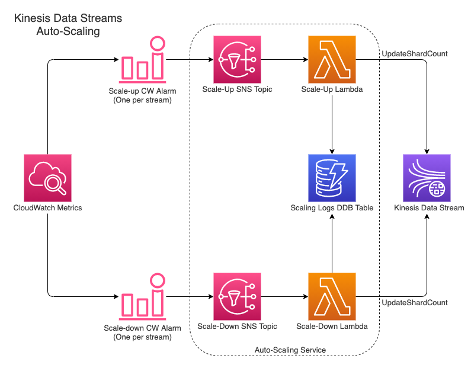

# Kinesis Autoscaler

An easy to deploy autoscaling solution for Kinesis data streams.

## Introduction

AWS Kinesis data streams doesn't have native autoscaling support.  
This solution purpose is to fill that need by automatically handling the scaling of Kinesis data streams in order to prevent data loss, avoid manual developer intervention and save cost.

## Solution Architecture

The suggested solution consists of 3 stages: triggers, delivery and execution.

- **CloudWatch alarms** - Defined for each stream that is subscribed to the autoscaling service. Responsible for starting the scaling operation by publishing to the relevant autoscaling service SNS topic.
- **SNS topics** - Exported by the autoscaling service and used as the entry point to the service. Responsible for invoking the relevant scaling lambda when receiving a message from the scaling alarms.
- **Scaling lambdas** - Calculates the target shard count, updates the stream and alarms according to it and writes a result log to a DynamoDB table.

## Usage

- Deploy the autoscaling service CloudFormation stack.
- Create 2 alarms (scale-up/scale-down) for each subscribed stream.
- Wire the alarms to the relevant exported SNS topics of the autoscaling service.

Example of how to subscribe a stream to the autoscaler service can be found in the `/examples` folder.

## Deployment

### Prerequisites

- Node 12+ (+npm)
- [Serverless Framework](https://www.serverless.com/) 2+
- Python 3.9+
- [Poetry](https://python-poetry.org/) 1+

### Service Deployment

The service is deployed using the [Serverless Framework](https://www.serverless.com/).  
Make sure to configure your AWS credentials (as environment variables or AWS profile) before running any command that interacts with AWS.

From the project root:

- `npm install` - Installs the Serverless Framework plugins
- `serverless deploy` - Deploys the service to AWS as a CF stack

### Region and Stage

By default, the service is deployed to `us-east-1` as a `dev` stage.  
Overriding that default configuration can be done by passing the stage and region flags to the Serverless Framework deploy command (e.g. `sls deploy --region eu-west-1 --stage production`).

## Usage Remarks and (current) Limitations

- Alarm names should be identical and contain either `scale-up` / `scale-down` in their name.  
  For example, `example-stream-scale-up-alarm` and `example-stream-scale-down-alarm`.
- Each alarm must have a math expression with the id `shardCount` and the current shard count of the stream (which will be updated automatically on each scale operation).
- Each alarm should have `incomingBytes` and/or `incomingRecords` metrics, as they are used for parsing the stream name.
